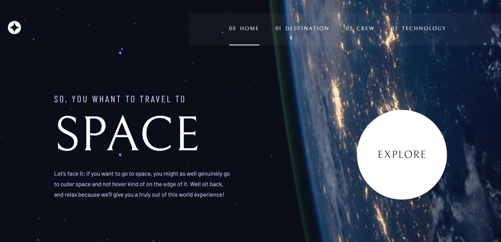

# Frontend Mentor - Space tourism website solution

This is a solution to the [Space tourism website challenge on Frontend Mentor](https://www.frontendmentor.io/challenges/space-tourism-multipage-website-gRWj1URZ3). Frontend Mentor challenges help you improve your coding skills by building realistic projects.

## Table of contents

- [Overview](#overview)
  - [The challenge](#the-challenge)
  - [Screenshot](#screenshot)
  - [Links](#links)
- [My process](#my-process)
  - [Built with](#built-with)
  - [What I learned](#what-i-learned)
  - [Continued development](#continued-development)
- [Author](#author)

## Overview

### The challenge

Users should be able to:

- View the optimal layout for each of the website's pages depending on their device's screen size
- See hover states for all interactive elements on the page
- View each page and be able to toggle between the tabs to see new information

### Screenshot

### Links

- Solution URL: [GITHUB](https://github.com/Seixaslima/space-tourism-website)
- Live Site URL: [Live site](https://space-tourism-website-eight-omega.vercel.app/)

## My process

### Built with

- CSS module
- Mobile-first workflow
- [Next.js](https://nextjs.org/) - React framework

### What I learned

Use envarimentl variables

### Continued development

Use styled-components to learn more options of styling

### Useful resources

## Author

- Website - [Lucas Seixas](https://github.com/Seixaslima/)
- Frontend Mentor - [@Seixaslima](https://www.frontendmentor.io/profile/Seixaslima)
